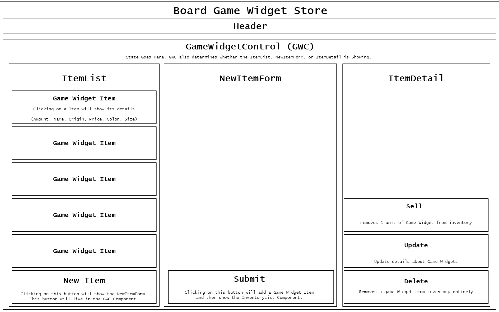

# Board Game Widget Store

#### _A simple website for selling board game accessories._

#### By _**Rob Sameh**_

## Technologies Used
* _React_
* _JavaScript_
* _HTML_
* _CSS_
* _Create React App_

## Description
This application was developed to utilize full CRUD functionality. Users can view inventory, add, update, and delete, and sell items. When a user purchases an item, the amount is reduced by one.


## Diagram



## Setup/Installation Requirements

* You may need to install Node.js on your machine in order to get working, you can follow the instructions here for more information: `https://www.learnhowtoprogram.com/intermediate-javascript/getting-started-with-javascript/installing-node-js`


**_Clone repository_**

*  _Clone git repository to local machine_
* run the command:
 ```
$ git clone https://github.com/rawbsrn/board-game-widget-store.git
``` 
* open directory with VScode by typing:
```

$ code .

```
**_Build Enviroment and open project in browser:_**
```

$ npm install

$ npm start

```

# Getting Started with Create React App

This project was bootstrapped with [Create React App](https://github.com/facebook/create-react-app).

## Available Scripts

In the project directory, you can run:

### `npm start`

Runs the app in the development mode.\
Open [http://localhost:3000](http://localhost:3000) to view it in your browser.

The page will reload when you make changes.\
You may also see any lint errors in the console.

### `npm test`

Launches the test runner in the interactive watch mode.\
See the section about [running tests](https://facebook.github.io/create-react-app/docs/running-tests) for more information.

### `npm run build`

Builds the app for production to the `build` folder.\
It correctly bundles React in production mode and optimizes the build for the best performance.

The build is minified and the filenames include the hashes.\
Your app is ready to be deployed!

See the section about [deployment](https://facebook.github.io/create-react-app/docs/deployment) for more information.

### `npm run eject`

**Note: this is a one-way operation. Once you `eject`, you can't go back!**

If you aren't satisfied with the build tool and configuration choices, you can `eject` at any time. This command will remove the single build dependency from your project.

Instead, it will copy all the configuration files and the transitive dependencies (webpack, Babel, ESLint, etc) right into your project so you have full control over them. All of the commands except `eject` will still work, but they will point to the copied scripts so you can tweak them. At this point you're on your own.

You don't have to ever use `eject`. The curated feature set is suitable for small and middle deployments, and you shouldn't feel obligated to use this feature. However we understand that this tool wouldn't be useful if you couldn't customize it when you are ready for it.

## Learn More

You can learn more in the [Create React App documentation](https://facebook.github.io/create-react-app/docs/getting-started).

To learn React, check out the [React documentation](https://reactjs.org/).

## Known Bugs

* Please report any issues to: Rob . Sameh @ gmail {dot} com

## License

 This program is free software: you can redistribute it and/or modify
    it under the terms of the GNU General Public License as published by
    the Free Software Foundation, either version 3 of the License, or
    (at your option) any later version.

    This program is distributed in the hope that it will be useful,
    but WITHOUT ANY WARRANTY; without even the implied warranty of
    MERCHANTABILITY or FITNESS FOR A PARTICULAR PURPOSE.  See the
    GNU General Public License for more details.

    You should have received a copy of the GNU General Public License
    along with this program.  If not, see <https://www.gnu.org/licenses/>.

Copyright (c) _2022_ _Sameh_